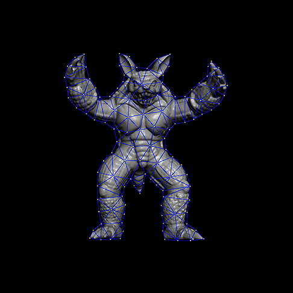
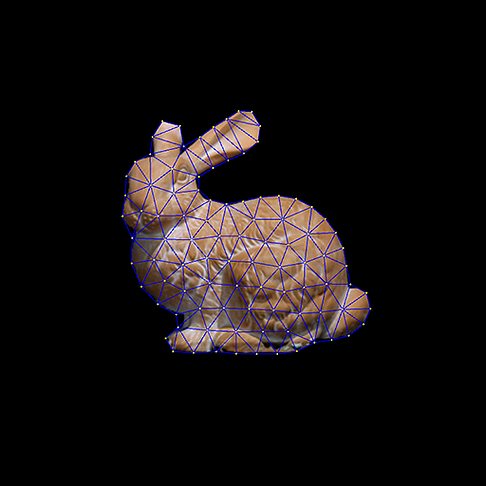
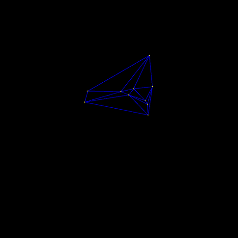
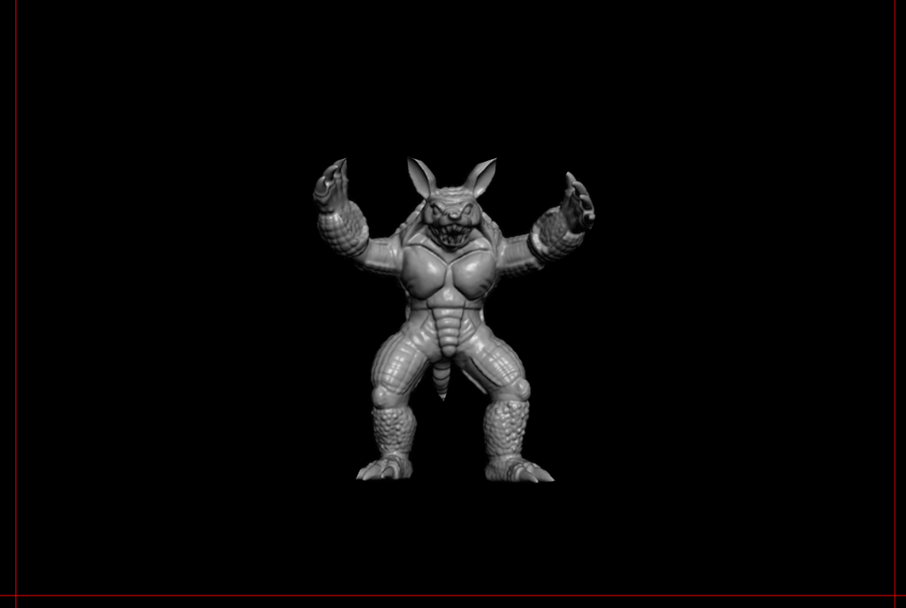

# 2D-Deformable-body-in-Unity
A 2D Deformable body simulation in Unity using FEM

This a port of the 2D FEM project by [Miles Macklin](http://blog.mmacklin.com/) found [here](https://github.com/mmacklin/sandbox) from C++/OpenGL to C# Unity. The code is not that stable and the physics can break if pushed too far but its a nice introduction to deformable bodies using the Finite Element Method.

The original did also implement fracturing of the mesh but I have not fully ported that and probably wont. The project provides a few options to load the scene with various meshes and has some neat code that creates a mesh from a image.

There's a armadillo, bunny and a donut.

There's also a few basic shapes created from code like a beam, torus and a random convex as shown below.

And here's a GIF of the armadillo being thrown around.

List of physics projects

[Position-Based-Dynamics](https://github.com/Scrawk/Position-Based-Dynamics)\
[PBD-Fluid-in-Unity](https://github.com/Scrawk/PBD-Fluid-in-Unity)\
[GPU-GEMS-NBody-Simulation](https://github.com/Scrawk/GPU-GEMS-NBody-Simulation)\
[GPU-GEMS-2D-Fluid-Simulation](https://github.com/Scrawk/GPU-GEMS-2D-Fluid-Simulation)\
[CyclonePhysicsEngine](https://github.com/Scrawk/CyclonePhysicsEngine)\
[2D-Deformable-body-in-Unity](https://github.com/Scrawk/2D-Deformable-body-in-Unity)
